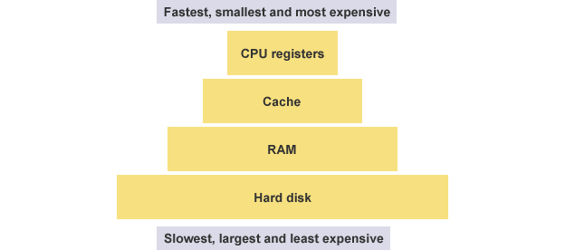

#汇编语言入门

汇编语言是二进制指令的文本形式，与指令是一一对应的关系。比如，加法指令00000011写成汇编语言就是 ADD。只要还原成二进制，汇编语言就可以被 CPU 直接执行，所以它是最底层的低级语言。

先来看寄存器。CPU 本身只负责运算，不负责储存数据。数据一般都储存在内存之中，CPU 要用的时候就去内存读写数据。但是，CPU 的运算速度远高于内存的读写速度，为了避免被拖慢，CPU 都自带一级缓存和二级缓存。基本上，CPU 缓存可以看作是读写速度较快的内存。

但是，CPU 缓存还是不够快，另外数据在缓存里面的地址是不固定的，CPU 每次读写都要寻址也会拖慢速度。因此，除了缓存之外，CPU 还自带了寄存器（register），用来储存最常用的数据

寄存器不依靠地址区分数据，而依靠名称。每一个寄存器都有自己的名称，我们告诉 CPU 去具体的哪一个寄存器拿数据，这样的速度是最快的。有人比喻寄存器是 CPU 的零级缓存。

heep堆 stack栈

这种因为用户主动请求而划分出来的内存区域，叫做 Heap（堆）。它由起始地址开始，从低位（地址）向高位（地址）增长。Heap 的一个重要特点就是不会自动消失，必须手动释放，或者由垃圾回收机制来回收

label  mnemonic   operands   ;comment

方括号中的字段是可选的。基本指令包括两段，第一段是要执行的指令（或助记符）的名称，第二段是命令的操作数或参数。
以下是一些典型汇编语言语句的示例-

