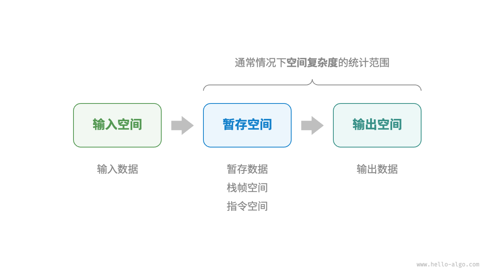

由于实际测试具有较大的局限性，因此我们可以考虑仅通过一些计算来评估算法的效率。这种估算方法被称为渐近复杂度分析（asymptotic complexity analysis），简称复杂度分析。

迭代（iteration）是一种重复执行某个任务的控制结构。在迭代中，程序会在满足一定的条件下重复执行某段代码，直到这个条件不再满足。

递归（recursion）是一种算法策略，通过函数调用自身来解决问题。它主要包含两个阶段。

汇编语言课上提到过 栈帧（stack frame） 的概念，简单回想一下： 每次调用和执行一个函数，都会在栈空间上开辟一片空间，这篇空间就叫“栈帧”。 栈帧里存放了执行这个函数需要的各种数据，包括局部变量、callee-save 寄存器等等。

与时间复杂度不同的是，我们通常只关注最差空间复杂度。这是因为内存空间是一项硬性要求，我们必须确保在所有输入数据下都有足够的内存空间预留

1.输入空间：用于存储算法的输入数据。
2.暂存空间：用于存储算法在运行过程中的变量、对象、函数上下文等数据。
3.输出空间：用于存储算法的输出数据。
一般情况下，空间复杂度的统计范围是“暂存空间”加上“输出空间”。

暂存空间可以进一步划分为三个部分。

1.暂存数据：用于保存算法运行过程中的各种常量、变量、对象等。
2.栈帧空间：用于保存调用函数的上下文数据。系统在每次调用函数时都会在栈顶部创建一个栈帧，函数返回后，栈帧空间会被释放。
3.指令空间：用于保存编译后的程序指令，在实际统计中通常忽略不计。

在分析一段程序的空间复杂度时，我们通常统计暂存数据、栈帧空间和输出数据三部分，如图 2-15 所示。

`/* 结构体 */
struct Node {
    int val;
    Node *next;
    Node(int x) : val(x), next(nullptr) {}
};

/* 函数 */
int func() {
    // 执行某些操作...
    return 0;
}

int algorithm(int n) {        // 输入数据
    const int a = 0;          // 暂存数据（常量）
    int b = 0;                // 暂存数据（变量）
    Node* node = new Node(0); // 暂存数据（对象）
    int c = func();           // 栈帧空间（调用函数）
    return a + b + c;         // 输出数据
}`